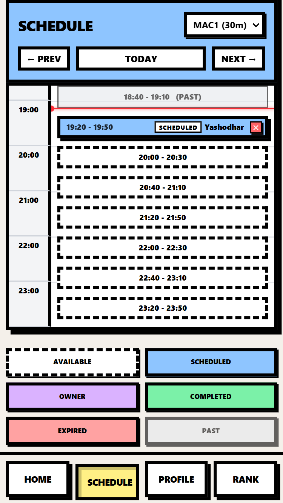
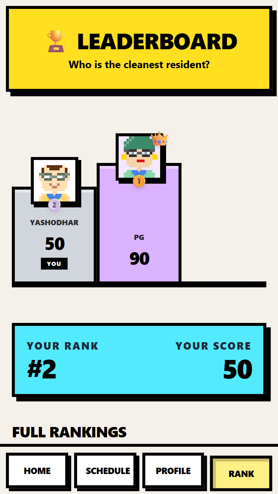

<div align="center">

<br />

<div style="font-size: 80px; margin-bottom: 20px;">
   
</div>


# Rinse

### The gamified laundry management system that keeps the peace in PG accommodations.

*Built by developers, for developers. An open-source solution to the ultimate roommate conflict.*

<br />

[](LICENSE)
[](https://github.com/YashodharChavan/rinse/pulls)
[](YOUR_WEBSITE_URL_HERE)


[](https://react.dev)
[](https://capacitorjs.com/)
[](https://tailwindcss.com)
[](https://supabase.com)
<br />

<div style="display:flex; justify-content:center; gap:8px; width: 100%; height: 300px"> 

   
   
   
</div>

</div>

---

## 🛑 The Problem

Every PG (Paying Guest) resident knows the chaos: fighting over the washing machine, residents booking slots and never showing up, and zero accountability. 

**Rinse** solves this through strict booking management and aggressive gamification.

---

## 🚀 The Secret Sauce (Core Features)

<table>
<tr>
<td width="50%" valign="top">

#### 🧹 The Lazy Sweeper
An automated background system that actively prevents "ghosting." If a user books a slot but fails to start their wash within **15 minutes**, the Sweeper auto-cancels the booking, changes the status to `incomplete`, and deducts 10 points from their score.

</td>
<td width="50%" valign="top">

#### 💯 Wash Score System
A 100-point trust mechanic. Completing a wash on time rewards **+2 points**. Ghosting triggers a **-10 point** penalty. Residents must maintain their score to prove they are responsible community members.

</td>
</tr>
<tr>
<td width="50%" valign="top">

#### 🏆 Olympic Leaderboard
A public ranking system within the specific PG. The top 3 cleanest, most responsible residents sit on a visual Gold, Silver, and Bronze podium.

</td>
<td width="50%" valign="top">

#### 📅 Retro Visual Schedule
A block-based 24-hour booking grid. Users can see exactly who is washing, whose slot has expired, and instantly claim open blocks.

</td>
</tr>
<tr>
<td width="50%" valign="top">

#### 👑 Dual-Dashboards
Dedicated interfaces based on roles. Owners can manage machines, approve/eject residents, and update PG details. Residents only see their booking tools and leaderboard.

</td>
<td width="50%" valign="top">

#### 🎨 Neo-Brutalist Design
Thick borders, heavy offset shadows, and bright, unapologetic pastel colors. The UI is built to feel tactile, fast, and distinctly retro.

</td>
</tr>
</table>

---

## 🏗️ Architecture & Tech Stack

| Layer | Technology | Purpose |
|---|---|---|
| **Frontend Framework** | React (Vite) | Fast, concurrent rendering and state management |
| **Styling** | Tailwind CSS | Utility-first classes for the Neo-Brutalist theme |
| **Database & Auth** | Supabase (PostgreSQL) | Real-time database, user authentication, and RLS |
| **Avatars** | DiceBear API | Dynamic, deterministic pixel-art avatar generation |
| **Icons** | Lucide React | Lightweight, consistent iconography |

---

## 🗄️ Database Schema

Rinse relies on a clean, relational PostgreSQL schema managed via Supabase.

### 1. `pgs` (Buildings)
Stores the physical properties.
- `id` (UUID, Primary Key)
- `name` (Text) - Name of the PG
- `address` (Text)
- `invite_code` (Text) - Unique code for residents to join

### 2. `profiles` (Users)
Linked to Supabase Auth.
- `id` (UUID, Primary Key)
- `pg_id` (UUID, Foreign Key -> `pgs.id`)
- `full_name` (Text)
- `phone` (Text)
- `role` (Enum: `'owner'`, `'resident'`)
- `wash_score` (Integer) - Defaults to `100`
- `is_approved` (Boolean) - Requires owner approval to access the schedule

### 3. `machines`
The physical washing machines in a PG.
- `id` (UUID, Primary Key)
- `pg_id` (UUID, Foreign Key -> `pgs.id`)
- `machine_number` (Integer)
- `cycle_duration` (Integer) - E.g., 30, 45, or 60 minutes

### 4. `schedule` (Bookings)
The core ledger for all wash cycles.
- `id` (UUID, Primary Key)
- `machine_id` (UUID, Foreign Key -> `machines.id`)
- `resident_id` (UUID, Foreign Key -> `profiles.id`)
- `start_time` (Timestamp)
- `end_time` (Timestamp)
- `status` (Enum: `'scheduled'`, `'active'`, `'completed'`, `'incomplete'`)

### 🗺️ Visual Architecture

```mermaid
erDiagram
    PGS ||--o{ PROFILES : "houses"
    PGS ||--o{ MACHINES : "contains"
    PROFILES ||--o{ SCHEDULE : "books"
    MACHINES ||--o{ SCHEDULE : "allocated_to"

    PGS {
        uuid id PK
        text name
        text address
        text invite_code
    }
    
    PROFILES {
        uuid id PK
        uuid pg_id FK
        text full_name
        text phone
        enum role
        int wash_score
        boolean is_approved
    }
    
    MACHINES {
        uuid id PK
        uuid pg_id FK
        int machine_number
        int cycle_duration
    }
    
    SCHEDULE {
        uuid id PK
        uuid machine_id FK
        uuid resident_id FK
        timestamp start_time
        timestamp end_time
        enum status
    }

   ```


---
## 🛠️ Setup Instructions

### Prerequisites

* Node.js 18+
* npm 18+
* A [Supabase](https://supabase.com) Project (The free tier is perfect)


### Local Installation

**1. Clone the repository**

```bash
git clone https://github.com/YashodharChavan/rinse.git
cd rinse
```

**2. Install dependencies**

```bash
npm install
```

**3. Configure the Database**
Rinse relies on Supabase. To run it locally without affecting the live PG data, you need to spin up your own free instance.

* Go to [Supabase](https://supabase.com) and create a free project.
* Navigate to the **SQL Editor** in your new dashboard.
* Copy the exact contents of [`database/schema.sql`](./database/schema.sql) from this repository and run it to instantly generate the required tables.

**4. Configure Environment Variables**
Create a `.env` file in the root directory. You will need your project URL and Anon Key (found in your Supabase Project Settings -> API).

```env
VITE_SUPABASE_URL=https://your-project-ref.supabase.co
VITE_SUPABASE_ANON_KEY=your_anon_key_here
```

*(Note: This project uses google authentication provider using supabase. So make sure you follow next instructions as well to obtain the necessary keys from [console.google.com](https://console.google.com)!)*

**5. Start the Development Server**

```bash
npm run dev
```

Open [http://localhost:5173](http://localhost:5173) to view the app in your browser.

---

## 🔐 Authentication Setup
Rinse uses Supabase Auth for a seamless login experience. To get the login screen working on your local machine, you need to enable the specific OAuth providers:

- Open your Supabase Dashboard and go to Authentication -> Providers.
- Enable the providers you want to use (e.g., Google or GitHub).
- You will need to drop in a Client ID and Client Secret. You can generate these for free via the Google Cloud Console or GitHub Developer Settings.

- Crucial Step: Go to Authentication -> URL Configuration in Supabase and add http://localhost:5173 to your Redirect URLs list. If you skip this, Supabase will block your local logins!

## 🤝 Contributing

If you are reading this because you want to contribute to Rinse, **you are genuinely the best kind of human being**. We absolutely love contributions! Whether you want to squash a bug, improve the Lazy Sweeper logic, or build a brand new Neo-Brutalist UI component, you are welcome here.

To keep this README clean, we have moved all the setup steps, branching rules, and Pull Request instructions to a dedicated guide.

Please read our [CONTRIBUTING.md](./CONTRIBUTING.md) to get Started!!


---

## 📄 License

Distributed under the MIT License.  See [LICENSE.md](./LICENSE) for more information. Use it, fork it, and keep the laundry peace.